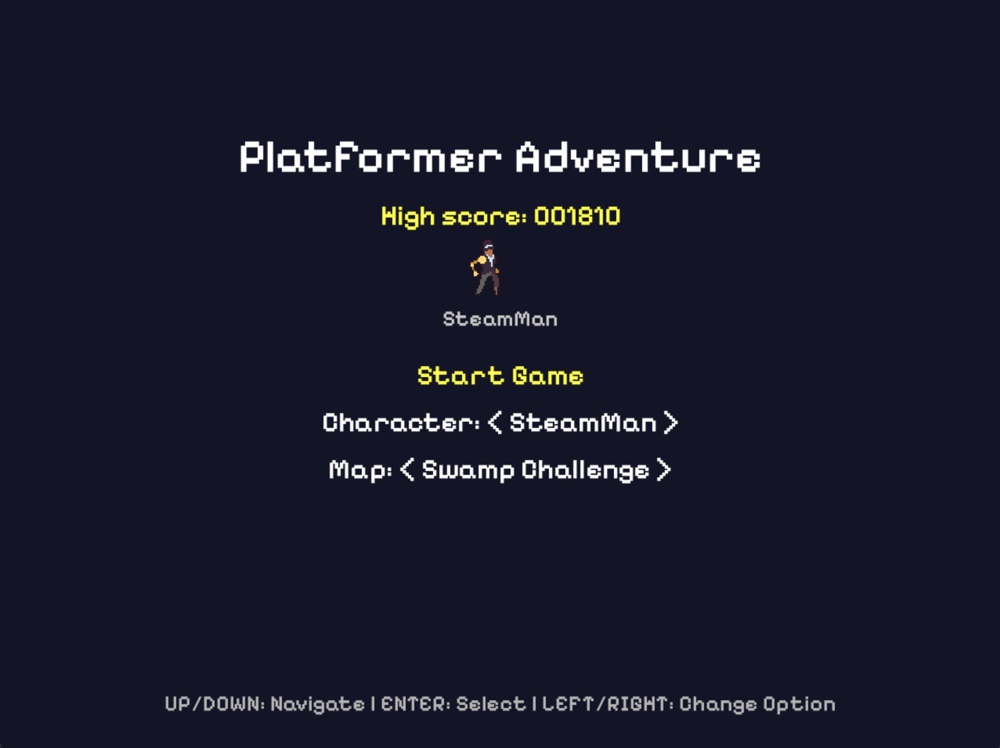
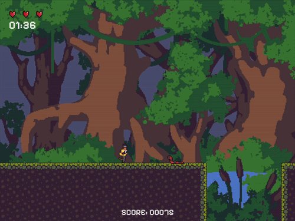
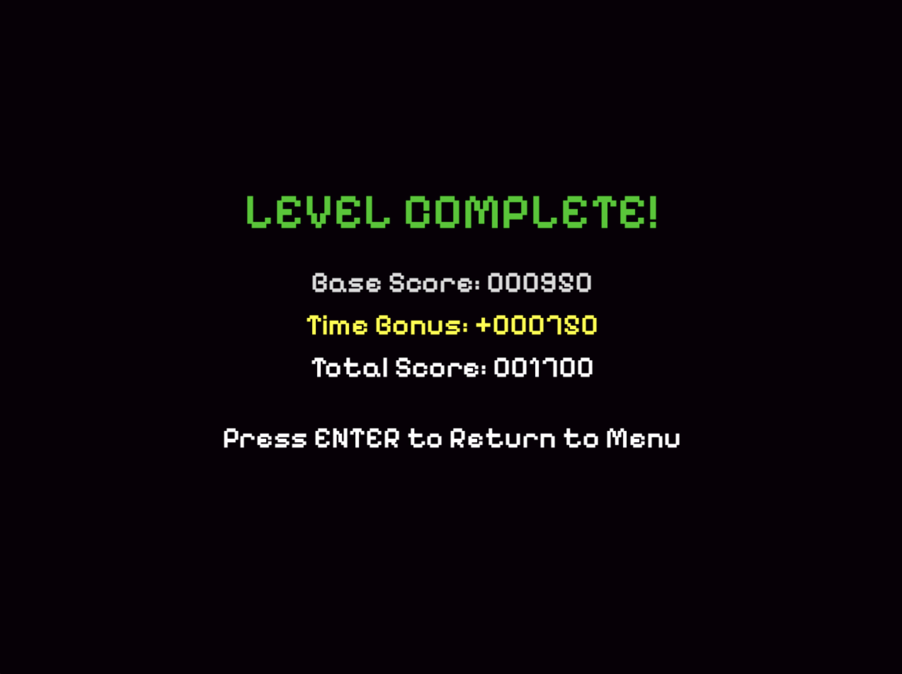

# 🎮 Platformer Adventure

**Platformer Adventure** to dynamiczna gra platformowa stworzona w Pythonie przy użyciu biblioteki Pygame. Celem gry jest przechodzenie kolejnych poziomów, zbieranie monet, walka z przeciwnikami i zdobywanie jak najwyższych wyników czasowych.

  

---

## 🕹️ Rozgrywka

- Wybierz postać i mapę.
- Unikaj przeciwników lub ich eliminuj.
- Zbieraj monety.
- Przejdź poziom jak najszybciej, by zdobyć maksymalną liczbę punktów.

  
   
  

---

## ⚙️ Sterowanie

Sterowanie opisane jest w menu gry na dole ekranu. W skrócie:

- **↑ / ↓** – Nawigacja po menu  
- **← / →** – Zmiana opcji (postać, mapa)  
- **Enter** – Potwierdzenie / Start gry  
- **WASD / Strzałki** – Poruszanie się  
- **Spacja** – Skok  
- **Esc** – Pauza / Wyjście  
